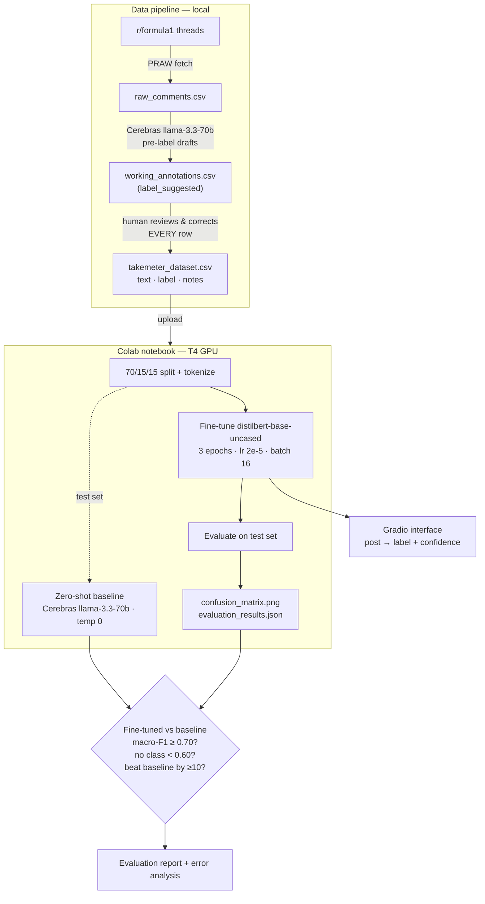
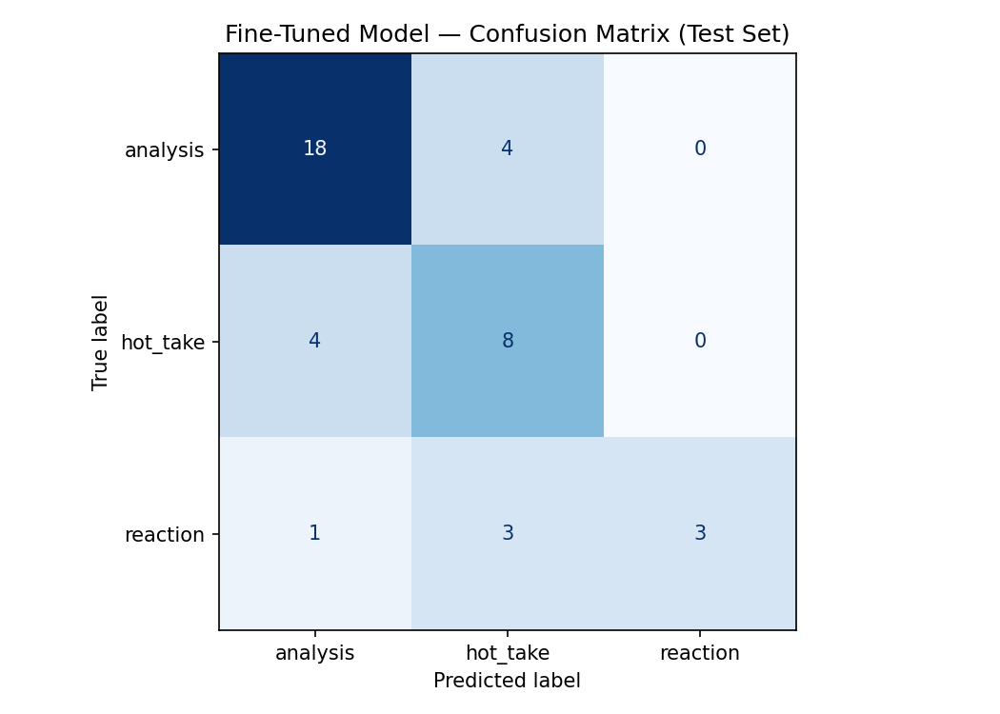

# TakeMeter

A fine-tuned text classifier that sorts r/formula1 comments by *what kind of discourse they are* — a reasoned argument, a bare opinion, or a gut reaction. It doesn't judge whether a take is right; it separates posts that do analytical work from posts that just assert or react.

---

## How to run it

> ⬜ **TODO (assembly):** fill in once the notebook and interface are final.

- **Fine-tuning + evaluation:** open the Colab notebook, set runtime to T4 GPU, upload `data/takemeter_dataset.csv`, run Sections 1–5.
- **Interface (stretch):** `python app/interface.py` (see [Deployed interface](#deployed-interface)).
- **Data pipeline (optional, to reproduce the dataset):** `pip install -r requirements.txt`, add credentials to `.env`, then `python scripts/collect.py` → `python scripts/prelabel.py` → human review → `python scripts/export_dataset.py`.

---

## Architecture

The load-bearing edge is the human-review step: pre-labels are drafts only, and the `label` column is never machine-populated.

---

## Community

**r/formula1.** F1 race threads are a clean fit because one event produces all three kinds of discourse at once: a strategist breaking down tyre deg and undercut windows, a fan declaring a driver "finished," and someone just screaming at the safety car. The community already polices this distinction — "source?" and "that's not analysis, that's a hot take" are native phrases — so the boundary I'm modeling is one regulars recognize, not one imposed from outside.

---

## Label taxonomy

Three labels on a single axis: descending analytical substance.

| Label | Definition |
|-------|-----------|
| `analysis` | A structured claim backed by specific, verifiable evidence (tactics, strategy, stats, regs, a technical mechanism). Strip the opinion framing and the evidence still stands as an argument. |
| `hot_take` | A bold, confident opinion asserted *without* real evidence. May cite one decorative stat, but it's selected for effect, not argument. |
| `reaction` | A non-analytical post driven by emotion or humor: in-the-moment feeling, memes, banter, copypasta. No claim being argued. |

**Examples**

- `analysis` — *"Strat call was insane — pitting under the VSC saved ~11s vs staying out, that's the whole podium."* / *"He's quicker on the softs but his tyre deg over a stint has been the worst on the grid all season, that's why they go long."*
- `hot_take` — *"Verstappen is just better than everyone, end of."* / *"Mercedes hasn't won because their floor concept is fundamentally wrong, full stop."*
- `reaction` — *"CRASHHHH did you SEE that"* / *"Imagine being a Williams fan in 2026, couldn't be me 💀"*

---

## Dataset

**Source.** Public top-level comments from r/formula1, collected from post-race discussion threads, race-day live threads, the daily discussion thread, and technical/strategy threads (to fill the rarer `analysis` class).

**Labeling process.** Comments were collected via a PRAW fetch script, pre-labeled by Cerebras `llama-3.3-70b` as drafts, then **every row was reviewed and corrected by hand** against the definitions above. Pre-labeling is disclosed in [AI usage](#ai-usage). Text was preserved exactly — emoji, casing, and punctuation are real signal, especially for `reaction`.

**Label distribution.**

> ⬜ **TODO (after annotation):** fill counts. No single label may exceed 70%.

| Label | Count |
|-------|-------|
| `analysis` | _TODO_ |
| `hot_take` | _TODO_ |
| `reaction` | _TODO_ |
| **Total** | _TODO (≥200)_ |

**Three genuinely difficult examples.**

> ⬜ **TODO (during annotation):** replace with 3 real posts that gave you pause. Seed below is the predicted hard case — keep it if a real one matches.

1. *"Mercedes' floor concept is fundamentally wrong, full stop."* — technical vocabulary but no mechanism or evidence. **Decided `hot_take`:** technical nouns don't make a post `analysis`; there's no argument under the assertion.
2. _TODO — a sarcasm case sitting between `reaction` and `hot_take`._
3. _TODO — your third real edge case._

---

## Fine-tuning

**Base model:** `distilbert-base-uncased` (HuggingFace).
**Platform:** Google Colab, free T4 GPU.
**Training setup:** 70/15/15 train/val/test split; 3 epochs, learning rate 2e-5, batch size 16.

**Key training decision.**

> ⬜ **TODO:** describe one decision with reasoning or observation — not "I used the default." If you kept defaults, justify why (e.g., "with ~140 training examples, 3 epochs was enough to converge without overfitting — val loss flattened after epoch 2"). If you changed something, say what and why.

---

## Baseline

**Approach.** Zero-shot classification: each test example is sent to a general LLM with no task-specific training, prompted with the label definitions and instructed to output only the label name.

**Provider note.** The spec's baseline is Groq's `llama-3.3-70b-versatile`. Groq signup errored across all three projects, so — as in Projects 1 and 2 — the baseline runs on **Cerebras `llama-3.3-70b`** (same underlying Meta Llama 3.3 70B model) via its OpenAI-compatible endpoint, called with `temperature=0` and a small `max_tokens` for clean, label-only output.

**Prompt used.**

> ⬜ **TODO:** paste the final classification prompt.

---

## Evaluation report

**Overall accuracy (same test set, both models).**

| Model | Accuracy |
|-------|----------|
| Zero-shot baseline (Cerebras llama-3.3-70b) | _TODO_ |
| Fine-tuned DistilBERT | _TODO_ |

**Per-class metrics (fine-tuned model).**

> ⬜ **TODO:** fill precision / recall / F1 per class from `evaluation_results.json`.

| Label | Precision | Recall | F1 |
|-------|-----------|--------|----|
| `analysis` | _TODO_ | _TODO_ | _TODO_ |
| `hot_take` | _TODO_ | _TODO_ | _TODO_ |
| `reaction` | _TODO_ | _TODO_ | _TODO_ |
| **Macro avg** | | | _TODO_ |

**Confusion matrix.**

> ⬜ **TODO:** fill the table from `evaluation_results.json` (and embed the PNG). Add one sentence reading the dominant off-diagonal cell — the predicted hot spot is **(true=`hot_take`, pred=`analysis`)**.

Rows = true label, columns = predicted. The diagonal is correct; off-diagonal cells show what gets confused and in which direction.

| true ↓ \ pred → | `analysis` | `hot_take` | `reaction` |
|---|---|---|---|
| **`analysis`** | _TODO_ | _TODO_ | _TODO_ |
| **`hot_take`** | _TODO_ | _TODO_ | _TODO_ |
| **`reaction`** | _TODO_ | _TODO_ | _TODO_ |

**Three wrong predictions analyzed.**

> ⬜ **TODO:** 3 real misclassifications. For each: the post, true label, predicted label, and *why* it failed — tied to the label boundary, the data, or model behavior. "It got it wrong" is not analysis.

1. _TODO_
2. _TODO_
3. _TODO_

**Sample classifications.**

> ⬜ **TODO:** 3–5 real posts run through the fine-tuned model, with predicted label and confidence. Explain why at least one correct prediction is reasonable. Text only (the grader uses this in place of demo narration).

| Post | Predicted | Confidence |
|------|-----------|-----------|
| _TODO_ | _TODO_ | _TODO_ |

---

## Reflection: what the model learned vs. what I intended

> ⬜ **TODO:** higher-level than the wrong-prediction list — the *gap* between the label definitions and what the model's decision boundary actually captured. Seed hypothesis: DistilBERT keys on token-level vocabulary, so it likely learned "technical words → `analysis`" rather than "evidence/mechanism present → `analysis`," over-predicting `analysis` on technical-sounding bare assertions. Confirm or revise against the actual confusion matrix.

---

## Spec reflection

> ⬜ **TODO:** one way the spec/`planning.md` helped guide the work, and one way the implementation diverged from it and why.

---

## AI usage

> ⬜ **TODO:** at least 2 specific instances — what you directed the AI to do, what it produced, what you revised or overrode.

1. **Annotation pre-labeling (disclosed).** I used Cerebras `llama-3.3-70b` to pre-label collected comments as drafts, then reviewed and corrected every row by hand. _TODO: report how many rows were pre-labeled and roughly how many you corrected._
2. _TODO — second instance (e.g., label stress-testing before annotation, or failure-pattern surfacing during error analysis), including what you overrode._

---

## Stretch features

### Error pattern analysis

> ⬜ **TODO:** name one systematic, generalizable error pattern with evidence from the error set (count of errors fitting it + example posts). Predicted: `hot_take` → `analysis` on technical-vocabulary bare assertions.

### Confidence calibration

> ⬜ **TODO:** bin test predictions by confidence and report accuracy per bin — do higher-confidence predictions get it right more often? Note the small-sample caveat (~30 test examples → directional, not definitive).

### Deployed interface

> ⬜ **TODO:** Gradio app — post in, label + confidence out. Document how to run it here (`python app/interface.py`, or the Colab cell + share link).

---

## Demo video

> ⬜ **TODO:** link to the 3–5 minute demo (3–5 posts classified with label + confidence, one correct prediction explained, one incorrect explained, brief eval-report walkthrough).
