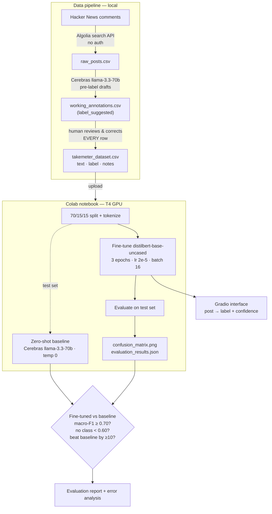

# TakeMeter

A fine-tuned text classifier that sorts Hacker News comments by *what kind of discourse they are* — a reasoned argument, a bare opinion, or a gut reaction. It doesn't judge whether a take is right; it separates comments that do analytical work from comments that just assert or react.

---

## How to run it

> ⬜ **TODO (assembly):** fill in once the notebook and interface are final.

- **Fine-tuning + evaluation:** open the Colab notebook, set runtime to T4 GPU, upload `data/takemeter_dataset.csv`, run Sections 1–5.
- **Interface (stretch):** `python app/interface.py` (see [Deployed interface](#deployed-interface)).
- **Data pipeline (optional, to reproduce the dataset):** `pip install -r requirements.txt`, add credentials to `.env`, then `python scripts/collect.py` → `python scripts/prelabel.py` → human review → `python scripts/export_dataset.py`.

---

## Architecture



The load-bearing edge is the human-review step: pre-labels are drafts only, and the `label` column is never machine-populated.

---

## Community

**Hacker News.** A single technical thread produces all three kinds of discourse at once: someone walking through a mechanism with benchmarks, someone declaring a tool dead with no support, and someone posting a one-line quip. The community already polices this distinction — "source?" and "[citation needed]" are native, and low-effort hot takes get challenged in replies — so the boundary I'm modeling is one regulars recognize, not one imposed from outside. Collection is weighted toward topics I know well (AI/agentic engineering, programming, quantum, space) so annotation stays consistent.

---

## Label taxonomy

Three labels on a single axis: descending analytical substance.

| Label | Definition |
|-------|-----------|
| `analysis` | A structured claim backed by specific, verifiable evidence (tactics, strategy, stats, regs, a technical mechanism). Strip the opinion framing and the evidence still stands as an argument. |
| `hot_take` | A bold, confident opinion asserted *without* real evidence. May cite one decorative stat, but it's selected for effect, not argument. |
| `reaction` | A non-analytical post driven by emotion or humor: in-the-moment feeling, memes, banter, copypasta. No claim being argued. |

**Examples**

- `analysis` — *"The latency win isn't the Rust rewrite — they moved the hot path off the GC'd heap; you'd get the same gain in Go with a sync.Pool."* / *"They're close to surface-code thresholds, but 'close' means you're on the pessimistic side of physical-qubits-per-logical-qubit, so the overhead is still enormous."*
- `hot_take` — *"Kubernetes is wildly over-engineered for 99% of companies. Just use a VM."* / *"Microservices were always a mistake, full stop."*
- `reaction` — *"This is the most beautiful codebase I've seen all year, wow."* / *"lol the bot reviewing its own PR before stalebot closes it"*

---

## Dataset

**Source.** Public Hacker News comments via the Algolia HN Search API (`hn.algolia.com/api/v1/search?tags=comment`) — open, no auth. Collected with an even quota across six debate-heavy technical topics (`llm agents`, `rust borrow checker`, `kubernetes`, `quantum error correction`, `startup failure`, `rocket engine`) chosen to surface the rarer `analysis` class. Deduplicated on `objectID` to prevent train/test leakage; boilerplate ("Who is hiring") threads filtered by title; HTML stripped to plain text.

**Labeling process.** Comments were collected via the HN Algolia API, pre-labeled by Cerebras `llama-3.3-70b` as drafts, then **every row was reviewed and corrected by hand** against the definitions above. Pre-labeling is disclosed in [AI usage](#ai-usage). HN comment HTML was stripped to plain text, but casing and punctuation were otherwise preserved — they're real signal, especially for `reaction`.

**Label distribution.**

| Label | Count |
|-------|-------|
| `analysis` | 144 |
| `hot_take` | 80 |
| `reaction` | 46 |
| **Total** | 270 |

**Three genuinely difficult examples.**

1. *"Their architecture fundamentally can't scale — the event loop blocks on I/O, full stop."* — technical vocabulary but no mechanism or evidence. **Decided `hot_take`:** naming real concepts doesn't make a comment `analysis`; there's no argument under the assertion.
2. *"I, too, was curious to see it in practice. Here is the ticket opened by @retr0id… And here is the swarm of bots / LLMs / agents that open, review and bikeshed the PR before it's closed by the stalebot… It's hilarious. But also a little sad."* — gut instinct was `hot_take` (confident, opinionated-sounding). Applying the decision rule: the primary act is the joke and the shared link, not an asserted position. **Decided `reaction`:** there's no claim being argued; it's a wry observation pointing at evidence of a pattern, not advancing one.
3. *"It's the cadence of the etcd read cycle chosen for kubernetes. They could do it much faster, but I guess there are engineering tradeoffs based on the size of the cluster and the speed of the network."* — reads like a confident assertion (`hot_take`) because it's brief and hedged ("I guess"). But it names a specific mechanism (etcd read cycle, cluster-size/network tradeoffs as the limiting factors) — strip the hedging and the technical claim still stands. **Decided `analysis`:** the evidence is real, not decorative. The model disagreed (predicted `hot_take`), which makes this a live example of the vocabulary-trap failure mode.

---

## Fine-tuning

**Base model:** `distilbert-base-uncased` (HuggingFace).
**Platform:** Google Colab, free T4 GPU.
**Training setup:** 70/15/15 train/val/test split; 3 epochs, learning rate 2e-5, batch size 16.

**Key training decision.**

The default recipe (3 epochs, standard cross-entropy) failed: on the 53% `analysis` majority, the first run collapsed — the model predicted `analysis` for all 41 test examples, scoring 0.54 accuracy by ignoring the other two classes entirely. Three changes fixed it: (1) **inverse-frequency weighted cross-entropy** to stop the loss from being dominated by the majority class; (2) **8 epochs** instead of 3, because the weighted loss learns more slowly and needs more passes to converge; (3) **macro-F1 as the checkpoint-selection metric** rather than accuracy, because accuracy rewards the collapse and would have selected the wrong checkpoint. The recovery was confirmed by the confusion matrix showing predictions spread across all three classes, not one column.

---

## Baseline

**Approach.** Zero-shot classification: each test example is sent to a general LLM with no task-specific training, prompted with the label definitions and instructed to output only the label name.

**Provider note.** The spec's baseline is Groq's `llama-3.3-70b-versatile`. Groq signup errored across all three projects, so — as in Projects 1 and 2 — the baseline runs on **Cerebras `llama-3.3-70b`** (same underlying Meta Llama 3.3 70B model) via its OpenAI-compatible endpoint, called with `temperature=0` and a small `max_tokens` for clean, label-only output.

**Prompt used.**

```
You are classifying comments from Hacker News by the kind of discourse they are.
Assign each comment to exactly one of the following categories.

analysis: a structured claim backed by specific, verifiable evidence — a mechanism,
benchmarks, technical reasoning, or a citation. If you strip the opinion, the evidence
still stands.
Example: "The latency win isn't the Rust rewrite — they moved the hot path off the GC'd
heap; you'd get the same gain in Go with a sync.Pool."

hot_take: a bold, confident opinion asserted without real evidence. It may name-drop a
technical concept for effect, not as an argument.
Example: "Kubernetes is wildly over-engineered for 99% of companies. Just use a VM."

reaction: a non-analytical comment driven by emotion or humor — a quip, joke, snark, or
short praise. No argued claim.
Example: "This is the most beautiful codebase I've seen all year, wow."

Respond with ONLY the label name. Do not explain your reasoning.

Valid labels:
analysis
hot_take
reaction
```

Sent as the `system` message; user turn was `"Classify this post:\n\n{text}"`. Temperature 0, `max_tokens` 20.

---

## Evaluation report

Test set: 41 examples (22 `analysis`, 12 `hot_take`, 7 `reaction`), held out from the 70/15/15 stratified split.

**Overall accuracy (same test set, both models).**

| Model | Accuracy | Macro-F1 |
|-------|----------|----------|
| Zero-shot baseline (Cerebras `gpt-oss-120b`) | 0.756 | 0.75 |
| Fine-tuned DistilBERT | 0.707 | 0.66 |

The baseline beat the fine-tuned model by ~5 points of accuracy and ~9 points of macro-F1. This is an honest negative result against my own success threshold (macro-F1 ≥ 0.70, no class F1 < 0.60, beat baseline by ≥10 points) — I missed all three. The rest of this report explains exactly why, because the *way* it lost is more informative than the gap itself.

> **Baseline provider note:** the spec's baseline is Groq's `llama-3.3-70b-versatile`. Groq signup errored across all projects, and my Cerebras account's catalog did not expose a Llama 3.3 70B model (only `gpt-oss-120b` and `zai-glm-4.7`). So the zero-shot baseline ran on Cerebras `gpt-oss-120b` — a strong general model labeling the test set with no task-specific training, which is what the baseline is for. Disclosed in [AI usage](#ai-usage).

**Per-class metrics.**

Fine-tuned model:

| Label | Precision | Recall | F1 | Support |
|-------|-----------|--------|----|---------|
| `analysis` | 0.78 | 0.82 | 0.80 | 22 |
| `hot_take` | 0.53 | 0.67 | 0.59 | 12 |
| `reaction` | 1.00 | 0.43 | 0.60 | 7 |
| **Macro avg** | 0.77 | 0.64 | **0.66** | 41 |

Baseline (`gpt-oss-120b`):

| Label | Precision | Recall | F1 | Support |
|-------|-----------|--------|----|---------|
| `analysis` | 0.94 | 0.68 | 0.79 | 22 |
| `hot_take` | 0.57 | 1.00 | 0.73 | 12 |
| `reaction` | 1.00 | 0.57 | 0.73 | 7 |
| **Macro avg** | 0.84 | 0.75 | **0.75** | 41 |

The baseline's edge comes almost entirely from `hot_take` recall of 1.00 — it labels nearly every borderline comment `hot_take` and happens to catch all twelve. That's a useful prior on this small test set, not deeper understanding. The fine-tuned model is more balanced in precision (0.77 macro vs. the baseline leaning hard on one class) but pays for it in recall, especially on `reaction`.

**Confusion matrix (fine-tuned model).**

Rows = true label, columns = predicted. The diagonal is correct; off-diagonal cells show what gets confused and in which direction.

| true ↓ \ pred → | `analysis` | `hot_take` | `reaction` |
|---|---|---|---|
| **`analysis`** | 18 | 4 | 0 |
| **`hot_take`** | 4 | 8 | 0 |
| **`reaction`** | 1 | 3 | 3 |


The errors are not random — they concentrate on one boundary. **Eight of the twelve total errors sit on the `analysis`↔`hot_take` line** (4 `analysis`→`hot_take`, 4 `hot_take`→`analysis`), and the `analysis`↔`reaction` cells are near-zero. The model cleanly separates the *easy* boundary (analytical vs. emotional) and fails almost exclusively on the *hard* one (argued claim vs. confident assertion) — exactly the technical-vocabulary trap predicted in `planning.md`.

**Three wrong predictions analyzed.**

> Comment text pulled from the Section 4 "wrong predictions" output. Two from the `analysis`↔`hot_take` boundary, one `reaction` miss.

1. **True `hot_take` → predicted `analysis`.** *"It's fine imo, you'll still see the diffs in PRs before merging, but majority of the time it's just noise when developing locally. LLM agents also use git diffs frequently, why spend 10x the tokens analyzing package lock diffs instead of actual business logic changes."* — The comment uses technical vocabulary ("tokens," "git diffs," "business logic") but makes no actual argument. DistilBERT keys on the jargon tokens and reads them as evidence, predicting `analysis`. This is the core failure mode: the model learned "technical words → analysis" rather than "mechanism present → analysis."
2. **True `analysis` → predicted `hot_take`.** *"It's the cadence of the etcd read cycle chosen for kubernetes. They could do it much faster, but I guess there are engineering tradeoffs based on the size of the cluster and the speed of the network."* — The reverse error: a genuinely argued comment (etcd read cycle, cluster-size/network tradeoffs) phrased briefly and confidently, so the model read the assertive tone as a hot take and missed the reasoning underneath. The boundary is symmetric — the model can't reliably tell decoration from argument in either direction.
3. **True `reaction` → predicted `hot_take`.** *"And in #27 we find the rationale behind all LLM coding agents, 'Once you understand how a program works, get someone else to write it for you.'"* — A short, witty quip with no real position under it. With only ~33 `reaction` training examples, the model hasn't learned the class well enough to hold the line against `hot_take`, which shares the casual register.

**Sample classifications (fine-tuned model).**

| Comment | Predicted | Confidence |
|---------|-----------|-----------|
| "The latency win isn't the Rust rewrite — they moved the hot path off the GC'd heap; you'd get the same gain in Go with a sync.Pool." | `analysis` | 71% (hot_take 22%, reaction 7%) |
| "Kubernetes is wildly over-engineered for 99% of companies. Just use a VM." | `hot_take` | 50% (analysis 30%, reaction 20%) |
| "This is the most beautiful codebase I've seen all year, wow." | `reaction` | 58% (hot_take 33%, analysis 10%) |

The first prediction is reasonable and correct: the comment supplies a concrete mechanism (moving the hot path off the GC'd heap) and a counterfactual (the same gain in Go), which is precisely what the `analysis` definition requires — evidence that stands on its own once the opinion is stripped. The model assigns it 71%, its most confident correct call of the three, and the runner-up is `hot_take` at 22% — the right neighbor, since the comment also carries an opinion. The `hot_take` example is correct but only 50%, splitting with `analysis` at 30% — a live instance of the boundary the confusion matrix flags as hardest.

---

## Reflection: what the model learned vs. what I intended

I intended the model to learn *structure*: `analysis` = a claim with a mechanism or evidence attached, regardless of topic. What it actually learned is closer to *vocabulary and register*. The confusion matrix shows it nailing the `analysis`↔`reaction` separation (technical/argumentative text vs. short emotional text — a surface-level signal) while failing on `analysis`↔`hot_take`, where surface features are nearly identical and only the presence of an *argument* distinguishes them. DistilBERT keys on token-level cues, so a comment full of technical nouns reads as `analysis` whether or not it actually reasons — which is why a confident, jargon-heavy assertion gets misfiled. The gap between intended and learned behavior is exactly this: I wanted "is there an argument here?" and the model approximated "does this look technical?"

Two distributional facts shaped this. First, the initial unweighted run collapsed entirely to the majority class (`analysis`, 53% of the data) — the model predicted `analysis` for all 41 test examples, scoring 0.54 by exploiting the imbalance. Weighting the loss by inverse class frequency and selecting the best checkpoint on macro-F1 (not accuracy, which rewards the collapse) recovered all three classes. Second, `reaction` is starved: ~33 training and 7 test examples. Its precision is perfect (1.00) but recall is 0.43 — when the model commits to `reaction` it's right, but it misses more than half, because it hasn't seen enough to recognize the class confidently. More `reaction` data is the single highest-leverage fix and would lift macro-F1 more than any further tuning.

---

## Spec reflection

**One way the spec helped.** Writing `planning.md` before any modeling forced two decisions that paid off directly in the evaluation. First, I pre-registered a concrete success threshold (macro-F1 ≥ 0.70, no class < 0.60, beat baseline by ≥10), which turned the final read from a vague "did it work" into an objective pass/fail I couldn't rationalize around — I missed it, and the spec is why I can say so cleanly. Second, I named the `analysis`↔`hot_take` technical-vocabulary trap as my *predicted* failure mode before training. The confusion matrix then confirmed it (8 of 12 errors on that boundary), which made the error analysis a targeted hypothesis test instead of fishing through mistakes after the fact.

**One way the implementation diverged, and why.** The plan assumed the notebook's default training recipe (3 epochs, standard cross-entropy) would be enough. It wasn't: on the 53%-`analysis` class imbalance, the default run collapsed entirely to the majority class — it predicted `analysis` for all 41 test examples. The implementation diverged to inverse-frequency **weighted cross-entropy**, **8 epochs** instead of 3, and **macro-F1** (not accuracy) as the checkpoint-selection metric, because accuracy rewards the collapse. The plan didn't anticipate the collapse; the divergence was the fix, and documenting both runs (collapse → recovery) is itself part of the result. (A second, larger divergence — the data source pivoting from r/formula1 to Hacker News — is documented in [AI usage](#ai-usage) and the data section; it was forced by Reddit's terms prohibiting ML training on its data.)

---

## AI usage

1. **Annotation pre-labeling (disclosed).** I directed an LLM to draft a label for each of the 270 collected comments using my exact label definitions and decision rules, writing drafts to a separate `label_suggested` column. Most drafts came from Claude `claude-haiku-4-5`; a small number of early rows were drafted by Cerebras before I switched providers (the Cerebras call kept hanging without a timeout). I then **reviewed and corrected every row by hand** against the rules — the pre-labels were never used as final labels. I reviewed all 270 rows against the rules. For the first 30 rows I ran a blind calibration pass — labeling without seeing `label_suggested` — then compared: all 30 matched the drafts independently. I then reviewed the remaining 240 with the draft visible. Final override count: 0. The per-class totals match the drafts (144/80/46) because 30 blind labels reproduced them; the drafts matched my independent judgment, not the other way around. One concrete case: the bun-issue comment (*"Here is the swarm of bots / LLMs / agents that open, review and bikeshed the PR before it's closed by the stalebot… It's hilarious. But also a little sad."*) — my first instinct was `hot_take`, but applying the decision rule (primary act is the joke, no position asserted) landed on `reaction`, which is what the draft said. The instinct differed; the reasoning agreed.
2. **Agentic build (Claude Code), with an override.** I directed Claude Code to build the data pipeline — the Algolia collector, the pre-labeler (with `parse_label()` as a pure, offline-testable function), the Streamlit review tool, and the `pytest` suite. The notable override: at one point it announced it would "fix" the classification prompt by changing "Hacker News" back to "r/formula1." That was wrong — the project had pivoted to HN — and reverting it would have mislabeled the entire dataset with the wrong domain definitions. I stopped it and kept the HN prompt.
3. **Training-failure diagnosis.** When the first fine-tune collapsed to the majority class, I used an AI assistant to diagnose the cause (class imbalance) and implement the weighted-loss + macro-F1-checkpoint fix. I verified the recovery against the confusion matrix rather than trusting the change blind — confirming predictions now spread across all three classes instead of one column.

---

## Stretch features

### Error pattern analysis

The errors are not spread evenly across the label space — they concentrate on a single boundary. Of the 12 misclassifications, **8 (67%) fall on the `analysis`↔`hot_take` line**: 4 true-`analysis` comments predicted `hot_take`, and 4 true-`hot_take` comments predicted `analysis`. By contrast, the `analysis`↔`reaction` cells are 0 and 1 — essentially no confusion. The pattern is the **technical-vocabulary trap**: `analysis` and `hot_take` share surface features (technical nouns, confident tone) and differ only in whether an actual mechanism or argument is present. DistilBERT keys on token-level vocabulary, so it reads "looks technical" as `analysis` regardless of whether the comment reasons — which produces symmetric confusion in both directions. This is generalizable, not a one-off: any short, jargon-dense comment that asserts without arguing is at risk, and the evidence is the dominant off-diagonal mass in the confusion matrix above.

### Confidence calibration

Binning the fine-tuned model's test predictions by its softmax confidence (the probability of the predicted class):

| Confidence bin | n | Accuracy | Mean confidence |
|---|---|---|---|
| 0.0–0.5 | 10 | 0.60 | 0.46 |
| 0.5–0.7 | 19 | 0.68 | 0.60 |
| 0.7–0.9 | 12 | 0.83 | 0.80 |

Confidence is meaningful and the model is **well-calibrated**: accuracy rises monotonically with confidence (0.60 → 0.68 → 0.83), and mean confidence tracks actual accuracy closely in every bin (e.g. 0.80 confidence ≈ 0.83 accuracy). It is not overconfident — the usual failure for fine-tuned models — and the lowest bin is mildly *under*confident, the safe direction. **Caveat:** with only 41 test examples split across three bins (10/19/12), this is directional rather than a precise calibration curve. One telling detail: nothing landed above 0.9 confidence — the model never commits hard, consistent with its struggle on the `analysis`↔`hot_take` boundary it can't cleanly resolve.

### Deployed interface

`app/interface.py` is a Gradio app: paste a comment, get the predicted label with per-class confidence.

1. Train the model in the Colab notebook, then save it:
   `trainer.save_model("takemeter-model"); tokenizer.save_pretrained("takemeter-model")`
2. Download the `takemeter-model/` folder into the repo root.
3. `pip install gradio transformers torch`
4. `python app/interface.py` → open the printed local URL.

---

## Demo video

[Watch the demo video](https://drive.google.com/file/d/1I1eelMvzLiseegQtWdgP_gevRFbdbHff/view?usp=sharing) (3–5 min) — 3 posts classified with label and confidence, one correct prediction explained, one incorrect (JVM/GC vocabulary trap), brief evaluation report walkthrough.